    
     
    
     

    
    
    
    

    
    
<em>Building scalable web applications with modern technologies and exploring AI/ML innovations.</em>

  

    
    

    
    
<em>Expertise across frontend, backend, databases, and modern development tools.</em>

      
    

        <table style="border-collapse: collapse; border-style: hidden; font-family: sans-serif; width: 100%;">
            <tr>
                <td align="left" valign="top" style="padding: 15px 20px; border-right: 3px solid #e2e8f0; font-weight: bold; width: 25%;">Core Skills</td>
                <td style="padding: 15px 10px;">
                     <code>React</code> &nbsp;
                     <code>Python</code> &nbsp;
                     <code>MySQL</code> &nbsp;
                     <code>C++</code>
                </td>
            </tr>
            <tr>
                <td align="left" valign="top" style="padding: 15px 20px; border-right: 3px solid #e2e8f0; font-weight: bold;">Frontend Skills</td>
                <td style="padding: 15px 10px;">
                     <code>Next.js</code> &nbsp;
                     <code>Tailwind</code> &nbsp;
                     <code>Vite</code> &nbsp;
                     <code>Figma</code>
                </td>
            </tr>
            <tr>
                <td align="left" valign="top" style="padding: 15px 20px; border-right: 3px solid #e2e8f0; font-weight: bold;">Backend Skills</td>
                <td style="padding: 15px 10px;">
                     <code>Node.js</code> &nbsp;
                     <code>Express</code> &nbsp;
                     <code>FastAPI</code> &nbsp;
                     <code>Django</code>
                </td>
            </tr>
            <tr>
                <td align="left" valign="top" style="padding: 15px 20px; border-right: 3px solid #e2e8f0; font-weight: bold;">Specialized Skills</td>
                <td style="padding: 15px 10px;">
                     <code>Framer</code> &nbsp;
                     <code>Microservices</code> &nbsp;
                     <code>Auth/JWT</code>
                </td>
            </tr>
        </table>
    

    
    
<em>Track my coding journey, contributions, and achievements across GitHub.</em>

  

    
      
    
      

  
    
      

  
    

 

    <em>Active contributor focusing on full-stack projects, AI/ML experiments, and open-source collaboration.</em>

    
    
<em>Interested in hiring me or collaborating on a project? Let's connect!</em>

  

  
    <!--  -->
    

    <a href="#top">⬆️ Back to top</a>

